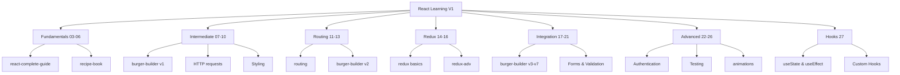
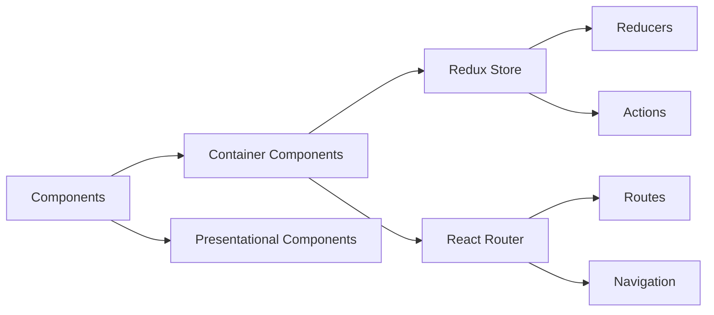

# React Learning V1

A comprehensive React learning repository containing progressive examples and projects from the "React - The Complete Guide (incl Hooks, React Router, Redux)" course by Academind by Maximilian Schwarzmüller.

Built in October 2018. This repository documents the learning journey through React fundamentals to advanced concepts including Hooks, Router, and Redux, organized in 25 incremental folders representing different learning stages.

## Features

- 📚 Progressive learning path from basics to advanced
- 🍔 Multiple Burger Builder implementations showing evolution
- 🧩 Component lifecycle and composition patterns
- 🎨 Styling approaches (CSS, CSS Modules, Radium)
- 🔄 State management with Redux
- 🛣️ Routing with React Router
- 🌐 HTTP requests and async operations
- 🎭 Animations and transitions
- 🔐 Authentication patterns
- 🪝 React Hooks (16.8.0-alpha)

## Getting Started

### Prerequisites

- Node.js (v10-v12 recommended for compatibility with 2018 dependencies)
- npm or yarn
- VSCode or any IDE

### Installation

1. Clone the repository:
```bash
git clone https://github.com/orassayag/react-learning-v1.git
cd react-learning-v1
```

2. Navigate to any example folder:
```bash
cd 03/react-complete-guide
```

3. Install dependencies:
```bash
npm install
```

4. Start the development server:
```bash
npm start
```

### Quick Start Examples

**Basic React Components:**
```bash
cd 03/react-complete-guide && npm install && npm start
```

**Burger Builder with Redux:**
```bash
cd 21/burger-builder && npm install && npm start
```

**React Hooks:**
```bash
cd 27/hooks && npm install && npm start
```

## Project Structure



### Folder Structure

```
react-learning-v1/
├── 03-06/          # React Fundamentals
│   ├── react-complete-guide/
│   └── recipe-book/
├── 07-10/          # Component Deep Dive
│   ├── burger-builder/
│   └── http/
├── 11-13/          # Routing
│   ├── routing/
│   └── burger-builder/
├── 14-16/          # Redux
│   ├── redux/
│   └── redux-adv/
├── 17-21/          # Integration
│   └── burger-builder/  (multiple versions)
├── 22-26/          # Advanced Topics
│   ├── animations/
│   └── burger-builder-css/
└── 27/             # React Hooks
    └── hooks/
```

## Learning Path

### Phase 1: Fundamentals (Folders 03-06)
- JSX syntax
- Components and props
- State management
- Event handling
- Lists and keys

### Phase 2: Intermediate (Folders 07-10)
- Component lifecycle
- HTTP requests with Axios
- Styling components
- Error handling
- Optimization

### Phase 3: Routing (Folders 11-13)
- React Router setup
- Navigation and links
- Route parameters
- Nested routes
- Guards and redirects

### Phase 4: Redux (Folders 14-16)
- Store and reducers
- Actions and action creators
- Connecting components
- Middleware
- Async actions

### Phase 5: Integration (Folders 17-21)
- Forms and validation
- Redux with routing
- Advanced patterns
- Authentication flow
- Production optimization

### Phase 6: Advanced (Folders 22-26)
- Animations
- Testing strategies
- Webpack configuration
- Deployment
- Performance optimization

### Phase 7: Modern React (Folder 27)
- useState Hook
- useEffect Hook
- Custom Hooks
- Rules of Hooks

## Key Projects

### Recipe Book
Simple application demonstrating:
- Component composition
- Props passing
- Basic styling

### Burger Builder (Multiple Versions)
Progressive enhancement showing:
- Complex state management
- Component communication
- HTTP requests to backend
- Routing integration
- Redux state management
- Form handling
- Authentication

Evolution across folders: 08 → 10 → 12 → 13 → 15 → 17 → 18 → 19 → 20 → 21 → 25 → 26

## Technology Stack

- **React**: 16.4.1 - 16.8.0-alpha
- **React Router**: 4.x - 5.x
- **Redux**: 4.x
- **Axios**: HTTP client
- **Radium**: Inline styling solution
- **Create React App**: Development environment
- **PropTypes**: Runtime type checking

## Available Scripts

In each project folder:

### `npm start`
Runs the app in development mode at `http://localhost:3000` with hot reloading.

### `npm run build`
Creates optimized production build in the `build/` folder.

### `npm test`
Launches the test runner in interactive watch mode.

### `npm run eject`
**Warning**: Irreversible operation. Ejects from Create React App.

## Architecture Patterns



## Development Workflow

1. **Explore** a learning stage folder
2. **Install** dependencies with `npm install`
3. **Run** with `npm start`
4. **Modify** code and see live updates
5. **Learn** from the implementation
6. **Progress** to the next stage

## Common Patterns Demonstrated

- Container/Presentational component pattern
- Higher-Order Components (HOCs)
- Render props
- State lifting
- Controlled components
- Uncontrolled components with refs
- Error boundaries
- Code splitting

## Contributing

Contributions to this project are [released](https://help.github.com/articles/github-terms-of-service/#6-contributions-under-repository-license) to the public under the [project's open source license](LICENSE).

Everyone is welcome to contribute. Contributing doesn't just mean submitting pull requests—there are many different ways to get involved, including answering questions, reporting issues, or improving documentation.

See [CONTRIBUTING.md](CONTRIBUTING.md) for detailed guidelines.

## Author

* **Or Assayag** - *Initial work* - [orassayag](https://github.com/orassayag)
* Or Assayag <orassayag@gmail.com>
* GitHub: https://github.com/orassayag
* StackOverflow: https://stackoverflow.com/users/4442606/or-assayag?tab=profile
* LinkedIn: https://linkedin.com/in/orassayag

## License

This application has an MIT license - see the [LICENSE](LICENSE) file for details.

## Acknowledgments

- **Maximilian Schwarzmüller** - Course instructor
- **Academind** - Course platform
- React community for excellent documentation

## Resources

- [React Documentation](https://reactjs.org/)
- [Redux Documentation](https://redux.js.org/)
- [React Router Documentation](https://reactrouter.com/)
- [Course Link](https://www.udemy.com/course/react-the-complete-guide-incl-redux/)
